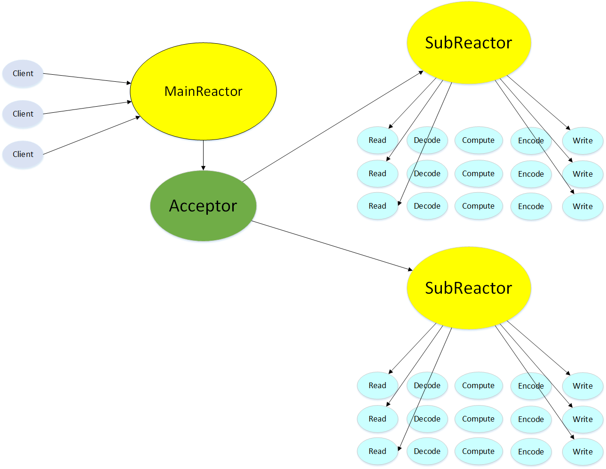

# High-Concurrency-Web-Server

## Introduction
- A multi-threaded web server to parse GET and HEAD requests, handle static resources, support HTTP long connection, and support Request Pipeline using Ubuntu 18 OS.
- A distributive server by non-blocking IO and asynchronous IO, Epoll, Pthread Pool via reactor mode.
- Designed Finite State Machine to parse HTTP messages, support GET/POST requests, long/short connections.
- Built a Min Heap timer to close timeout requests to solve timeout-related resource consumption problem.
- Utilized RAII (smart pointer etc.) to solve Memory Leak and Double Buffering for Asynchronous Logging.

## Tech Stack
C++, Linux, TCP/IP Protocol, Multi-threading, High-Concurrency

## Architecture
### Main Thread:
- **in the main thread, I used epoll to listen to socket and then process the external IO event in the socket,** including the connected client’s writing request (sending message), or the connecting request of new client.
- **Encapsulate the request of the ready IO socket as an object. Which is a requestData object.** 
- Let the timer of the requestData obj is NULL. **That is to say, after processing a requestData, we will delete that object**. Therefore, the default connection is a short connection. If the message includes that it is a long connection, we will add the timer.
- The main thread will assign those objects in the **Round-robin methods to** task queue of the thread pool.
- There is also a while loop in the main thread. We used the timer to delete timeout events.
### Working thread:
- **working thread use condition variable and mutex to pull task from the tasks queue.** Then used the processing function to parse HTTP messages, then send http response.
- If there is a keep-alive setting in the message. Then requestData would not be deleted, it will be kept alive. Long connection is not permenantly stored. It also have timeout.
- Then put it in the min-heap of timer.

